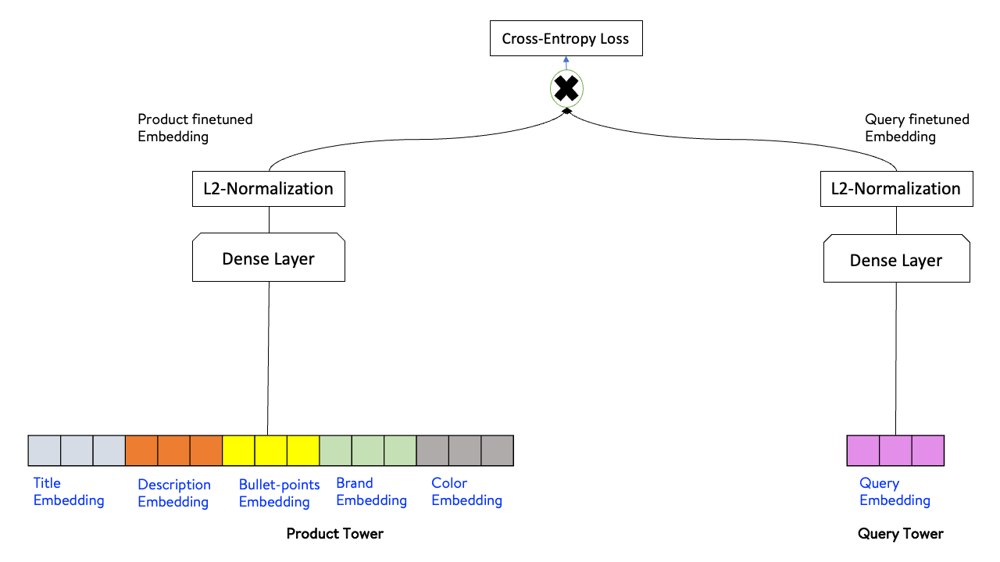
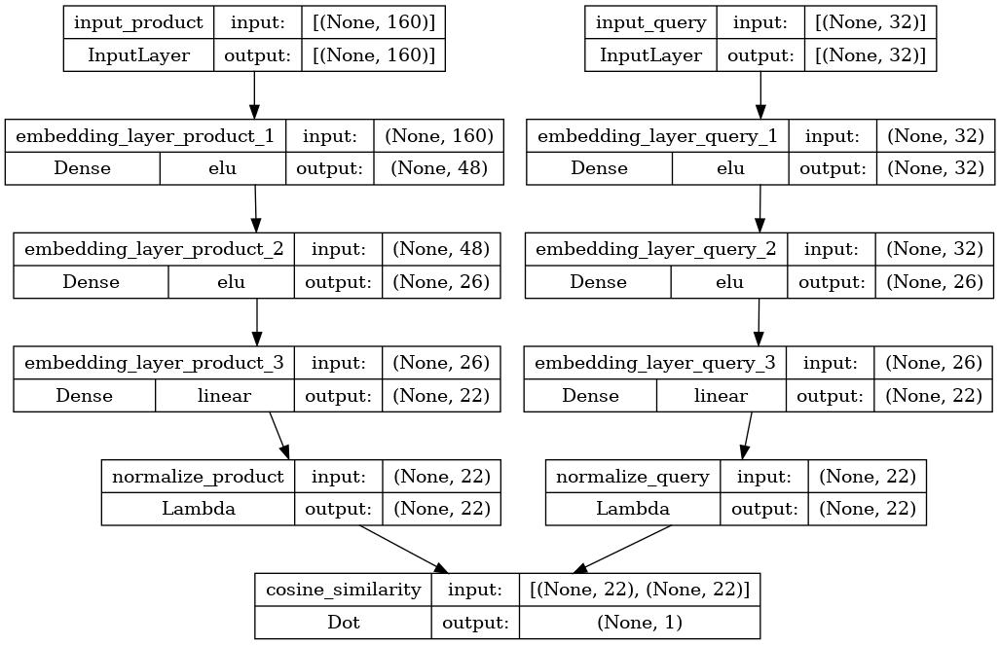
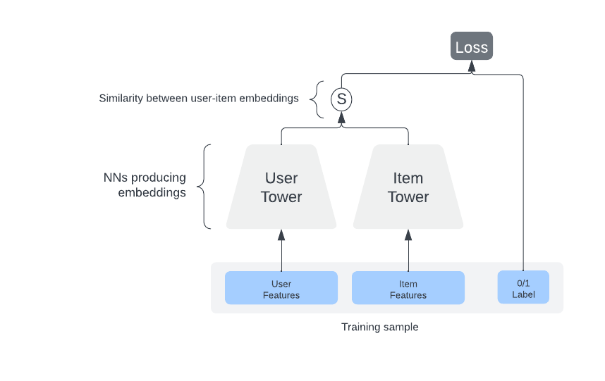
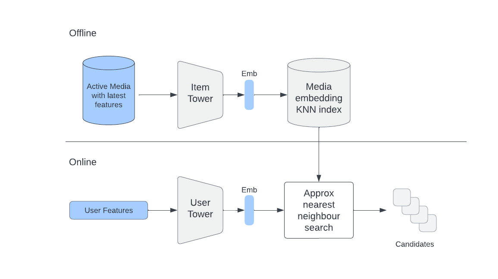

# Two Tower Retrieval Recommendation System

## Overview

The Two Tower Retrieval Recommendation System revolutionizes personalized recommendations by efficiently matching user preferences with relevant items. By leveraging separate neural networks for users and items, this system ensures accuracy and effectiveness in recommendation matching. This README provides a comprehensive overview of the project, including its architecture, training process, and usage.

## Architecture

The Two Tower Retrieval Recommendation System comprises two distinct neural networks: one dedicated to users query and the other to items. Each network processes entity-specific features and generates embeddings of 22-dimension, representing users query and items in a high-dimensional space. This architecture allows the system to capture intricate user preferences and detailed item characteristics for precise recommendation matching.


## Training
Prepared the AmazonProductSearch MiniDataset(150k) containing user query and product attributes. Ensured that the dataset is well-labeled and split into appropriate training and validation sets.
The Two Tower Recommendation System is trained using binary cross-entropy as the loss function. The system utilizes Hugging Face Transformer for generating embeddings. We employ the DistilBERT model, specifically distilbert-base-uncased, for embedding generation.

## Online Retrieval
During online retrieval, the query tower dynamically generates a user embedding using real-time user-side features. This embedding serves as a representation of the user's preferences and characteristics. The system then utilizes an online approximate nearest neighbors (ANN) search service, such as Annoy search, to efficiently identify the most relevant items for the given user.

By leveraging the user embedding and ANN search, the system can quickly retrieve a subset of items that are likely to be of interest to the user. This process enables the system to deliver timely and accurate recommendations, enhancing the user experience and increasing engagement.

## Files Included

1. `ttrecsys.ipynb`: Jupyter notebook for training the Two Tower model and evaluating the trained model's performance.
2. `README.md`: Documentation file explaining the project and providing instructions on how to use it effectively.

## Dependencies

This project relies on the following Python libraries:

- TensorFlow: Deep learning framework for building and training neural networks.
- Keras: High-level neural networks API for easy model building and training.
- NumPy: Library for numerical computations and array manipulation.
- Pandas: Data manipulation and analysis library for handling datasets.
- Hugging Face Transformer: Library for natural language processing tasks and transformer-based models.
- Annoy: Approximate nearest neighbors implementation for efficient retrieval of similar items.

Install these dependencies using `pip`:

```
pip install tensorflow keras numpy pandas transformers annoy
```

## Usage

To use the Two Tower Retrieval Recommendation System, follow these steps:

1. Prepare your dataset with user interactions and item attributes.
2. Train the Two Tower model using the provided Jupyter notebook (`ttrecsys.ipynb`).
3. Evaluate the trained model's performance and fine-tune hyperparameters as needed.
4. Deploy the trained model for online retrieval, ensuring to generate user embeddings dynamically and utilize an approximate nearest neighbors (ANN) search service for efficient item retrieval.

Experiment with different hyperparameters, data preprocessing techniques, and model architectures to optimize the system's performance further.

## Conclusion
The Two Tower Recommendation System with the AmazonProductSearch MiniDataset offers a powerful solution for personalized recommendation tasks. By leveraging state-of-the-art techniques such as transfer learning with DistilBERT and binary cross-entropy loss, this system can efficiently match user preferences with relevant items from the AmazonProductSearch MiniDataset, enhancing user experience and engagement.


## Author

Kaustubh Gupta
